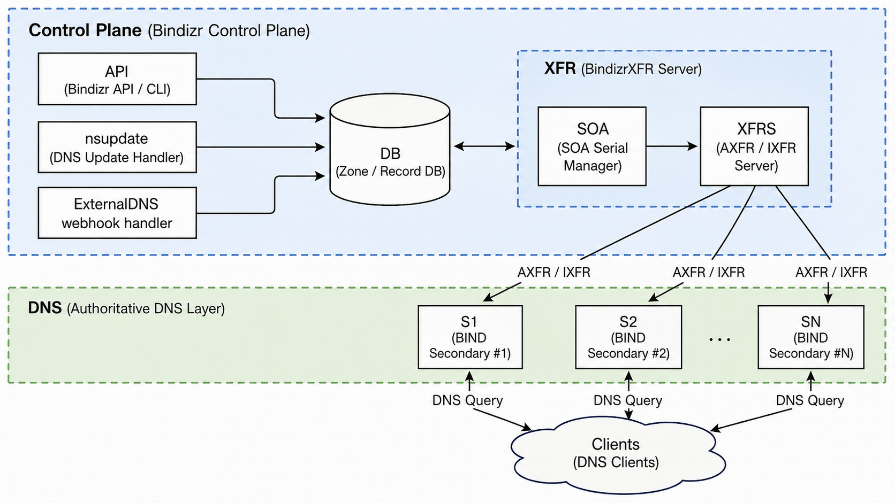

<div align="center">
<p align="center">
    
</p>

DNS Synchronization Service for BIND9

<p>
    <a href="https://github.com/netbirdio/netbird/blob/main/LICENSE">
        
    </a>
    <a href="https://github.com/kweonminsung/bindizr/actions/workflows/ci.yml">
        
    </a>
    <br>
    <a href="https://app.codacy.com/gh/kweonminsung/bindizr/dashboard?utm_source=gh&utm_medium=referral&utm_content=&utm_campaign=Badge_grade">
        
    </a>
</p>

**[Documentation](https://kweonminsung.github.io/bindizr/) &nbsp;·&nbsp; [API Reference](https://kweonminsung.github.io/bindizr/api/)**

</div>

**Bindizr** is a Rust-based DNS control plane that manages zones and records via an HTTP API or CLI, stores data in a database backend (MySQL, PostgreSQL, or SQLite), and propagates changes to BIND9 secondary servers via AXFR/IXFR using DNS Catalog Zones.

&nbsp;

Bindizr owns the zone data and the transfer path; standard BIND9 secondaries discover zones through the catalog zone (RFC 9432) and answer client queries. Adding it in front of BIND9 costs nothing on the query path — `Bindizr + BIND9` serves **62,448 QPS against native BIND9's 61,629**.

## Features

- **Zone and Record Management** — full CRUD through the HTTP API or CLI, including bulk inserts, BIND master-file import/export, and dry-run diff previews.
- **Multiple Database Backends** — MySQL, PostgreSQL, or SQLite.
- **Zone Transfers (AXFR/IXFR)** — automatic SOA serial management and an optional per-serial zone cache.
- **Automatic Zone Provisioning** — DNS Catalog Zones (RFC 9432) let secondaries discover created and deleted zones without configuration changes.
- **DNS NOTIFY** — configurable retries and timeouts, plus a sync/async apply mode that batches NOTIFYs under load.
- **nsupdate (Dynamic Update)** — RFC 2136 dynamic updates with TSIG-signed requests, managed keys, and per-zone update policies.
- **Zone History** — per-serial snapshots with diffs between serials and rollback.
- **Observability** — health probe, Prometheus metrics at `/metrics`, and `bindizr doctor` end-to-end diagnostics.

## Quick Start

Pick one. Each is walked through in full on the
[documentation site](https://kweonminsung.github.io/bindizr/).

### Kubernetes

The chart can bring its own PostgreSQL for a first look; in production, point it
at your database instead.

```bash
$ helm install bindizr oci://registry-1.docker.io/kweonminsung/bindizr-chart \
  --version 0.1.0-beta.6 --set postgresql.enabled=true
```

### Docker Swarm

Brings up Bindizr, PostgreSQL, and BIND9 on an overlay network.

```bash
$ docker stack deploy -c docker-compose.yml bindizr
```

### Package install

```bash
$ sudo dpkg -i bindizr_*_amd64.deb    # Debian, Ubuntu
$ sudo rpm -i bindizr-*.x86_64.rpm    # Fedora, CentOS, RHEL
```

The package ships a placeholder database URL, so set yours in
`/etc/bindizr/bindizr.conf.toml` before starting. BIND9 has to be pointed at the
catalog zone as well — the manual installation guide covers both.

```bash
$ sudo systemctl enable --now bindizr
```

---

However you installed it, this checks the whole path end to end:

```bash
$ bindizr doctor
```

API authentication is on by default for Helm and package installs — the Compose
stack ships with it off. Create a token before calling the API:

```bash
$ bindizr token create
```

## Documentation

Deployment, configuration, the CLI, the HTTP API, and the benchmarks are all at
**[kweonminsung.github.io/bindizr](https://kweonminsung.github.io/bindizr/)**.

## Contributing

Bug reports, documentation fixes, and pull requests are welcome — see [CONTRIBUTING.md](CONTRIBUTING.md) for the development setup, the test and lint commands, and the project conventions a review will check against.

## License

This project is licensed under the [Apache License 2.0](https://www.apache.org/licenses/LICENSE-2.0).
