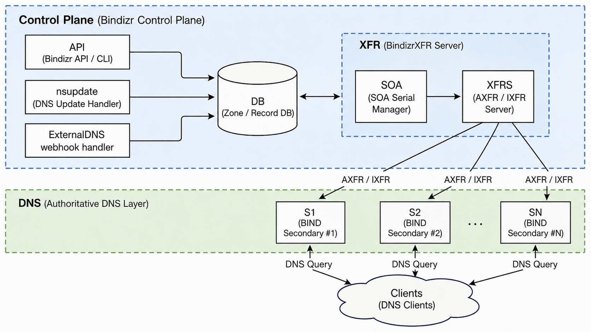
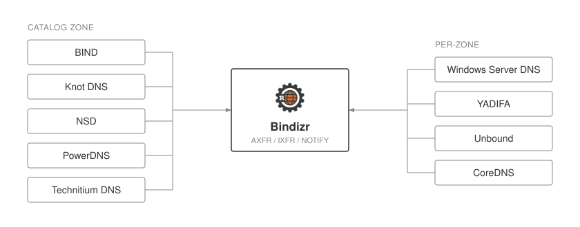

<div align="center">
<p align="center">
    
</p>

Open-source control plane for authoritative DNS

<p>
    <a href="https://github.com/netbirdio/netbird/blob/main/LICENSE">
        
    </a>
    <a href="https://github.com/kweonminsung/bindizr/actions/workflows/ci.yml">
        
    </a>
    <br>
    <a href="https://app.codacy.com/gh/kweonminsung/bindizr/dashboard?utm_source=gh&utm_medium=referral&utm_content=&utm_campaign=Badge_grade">
        
    </a>
</p>

**[Documentation](https://kweonminsung.github.io/bindizr/) &nbsp;·&nbsp; [API Reference](https://kweonminsung.github.io/bindizr/api/)**

</div>

**Bindizr** is a Rust-based DNS control plane that manages zones and records via an HTTP API or CLI, stores data in a database backend (MySQL, PostgreSQL, or SQLite), and propagates changes to secondaries such as BIND, Knot DNS, NSD, PowerDNS, Technitium, and Windows Server DNS via AXFR/IXFR, using DNS Catalog Zones where the secondary reads them.

&nbsp;

Bindizr owns the zone data and the transfer path; any secondary that consumes a catalog zone (RFC 9432) — BIND, Knot DNS, NSD, PowerDNS, or Technitium — discovers zones through it and answers client queries. Adding it in front of a server costs nothing on the query path — `Bindizr + BIND9` serves **59,397 QPS against native BIND's 59,904**, and the Knot DNS and PowerDNS pairings track their servers the same way.

## Features

- **Zone and Record Management** — full CRUD through the HTTP API, documented by OpenAPI, or the CLI, including bulk inserts, BIND master-file import/export, and dry-run diff previews.
- **Multiple Database Backends** — MySQL, PostgreSQL, or SQLite.
- **Zone Transfers (AXFR/IXFR)** — automatic SOA serial management and an optional per-serial transfer cache. A zone served elsewhere moves over in one command.
- **Automatic Zone Provisioning** — DNS Catalog Zones (RFC 9432) let secondaries discover created and deleted zones without configuration changes.
- **DNS NOTIFY** — configurable retries and timeouts, plus an optional batching window that collapses a burst into one NOTIFY per zone.
- **nsupdate (Dynamic Update)** — RFC 2136 dynamic updates with TSIG-signed requests and managed keys.
- **Role-Based Access Control** — API tokens and TSIG keys authenticate into roles whose grants set the zones, actions, record names, and record types each may touch.
- **DNSSEC** — named signing policies, automatic signing and re-signing, automatic ZSK and operator-confirmed CSK/KSK rollovers, BIND-format key import/export, and a parent-DS check before a zone goes insecure.
- **ExternalDNS Provider** — a webhook adapter that lets Kubernetes ExternalDNS manage records in opted-in zones through the authenticated API.
- **Zone Versions** — a version per serial, with diffs between serials and rollback.
- **Observability** — health probe, Prometheus metrics at `/metrics`, text or JSON logs, and `bindizr status` / `bindizr doctor` diagnostics.

## Supported DNS Servers



Every server above has been run as a Bindizr secondary: transfers, NOTIFY-driven updates, and DNSSEC-signed zones. The left column learns zones from the catalog zone; the right one is given each zone by hand. Versions, TSIG support, and each server's configuration are in [Secondary Servers](https://kweonminsung.github.io/bindizr/secondaries/).

## Roadmap

- **Cloud DNS Providers** — a secondary today is a server that takes
  AXFR/IXFR. Pushing zones to Route 53, Cloud DNS, Azure DNS, and Cloudflare
  through their APIs lets a managed provider hold a copy where no transfer
  reaches.
- **Webhooks** — a change is visible today only by polling the API or the
  zone versions. Posting each zone, record, and DNSSEC key event to a
  configured URL lets other systems react as it happens.
- **More Record Types** — fourteen types are stored today, and an import
  drops the rest with `--skip-unsupported`. Adding SVCB/HTTPS and storing any
  other type in its RFC 3597 generic form lets a zone move over whole.
- **Audit Log** — a zone change names its source and actor in the zone's
  versions, but a change to a token, role, grant, TSIG key, secondary, or
  policy leaves no trace. Logging each one answers who changed what, and
  when.
- **Bulk Migration** — `zone import --from-server` moves one zone per
  command. Importing every zone an existing primary serves in one run moves
  a whole server.
- **Transfers over TLS** — transfers run over plain TCP with TSIG today.
  XoT (RFC 9103) encrypts them to the BIND, Knot DNS, and NSD versions that
  speak it.
- **Terraform Provider** — infrastructure as code reaches Bindizr through
  the ExternalDNS adapter alone. A provider over the HTTP API lets zones,
  records, and access rights be declared beside the rest of the stack.

## Quick Start

Pick one. Each is walked through in full on the
[documentation site](https://kweonminsung.github.io/bindizr/).

### Kubernetes

The chart can bring its own PostgreSQL for a first look; in production, point it
at your database instead.
The default BIND image is amd64-only. On arm64, use the image override in the
[Kubernetes guide](docs/deployment/kubernetes.md#1-install).

```bash
$ helm install bindizr oci://registry-1.docker.io/kweonminsung/bindizr-chart \
  --version 0.1.0-rc.2 --set postgresql.enabled=true
```

### Docker Compose

Builds the image from the working tree and brings up Bindizr, PostgreSQL, and
two BIND secondaries on one host.

On amd64:

```bash
$ docker compose -f examples/compose/docker-compose.yml up -d --build
```

On arm64, add the BIND image overlay:

```bash
$ docker compose -f examples/compose/docker-compose.yml \
  -f examples/compose/docker-compose.arm.yml up -d --build
```

### Docker Swarm

Brings up Bindizr, PostgreSQL, and BIND on an overlay network.
The example's BIND image is amd64-only; choose an arm64 BIND image before
deploying it on arm64 nodes.

```bash
$ docker stack deploy -c examples/swarm/docker-compose.yml bindizr
```

### Package install

```bash
$ sudo dpkg -i bindizr_*_amd64.deb    # Debian, Ubuntu (bindizr_*_arm64.deb on arm64)
$ sudo rpm -i bindizr-*.x86_64.rpm    # Fedora, CentOS, RHEL (bindizr-*.aarch64.rpm on arm64)
```

The package runs on SQLite out of the box and serves zone transfers on port
5300, leaving 53 to the secondary. Point the secondary at the catalog zone —
[Secondary Servers](https://kweonminsung.github.io/bindizr/secondaries/)
has the configuration for each supported server — then start.

```bash
$ sudo systemctl start bindizr
$ sudo bindizr doctor
$ sudo bindizr token create admin --role admin
```

For container installs, run `doctor` through `docker compose exec` or
`kubectl exec` as shown in the [Docker Compose](docs/deployment/docker-compose.md)
and [Kubernetes](docs/deployment/kubernetes.md) walkthroughs. Kubernetes also
needs its first API token created in the pod; the Compose example disables API
authentication.

## Documentation

Deployment, configuration, the CLI, the HTTP API, and the benchmarks are all at
**[kweonminsung.github.io/bindizr](https://kweonminsung.github.io/bindizr/)**.

## Contributing

Bug reports, documentation fixes, and pull requests are welcome — see [CONTRIBUTING.md](CONTRIBUTING.md) for the development setup, the test and lint commands, and the project conventions a review will check against.

## License

This project is licensed under the [Apache License 2.0](https://www.apache.org/licenses/LICENSE-2.0).
